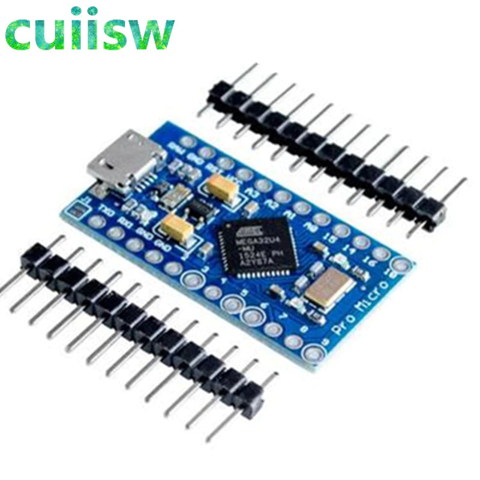
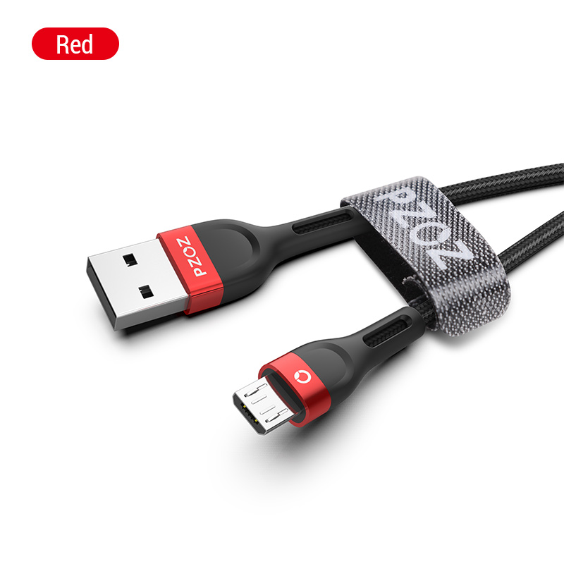
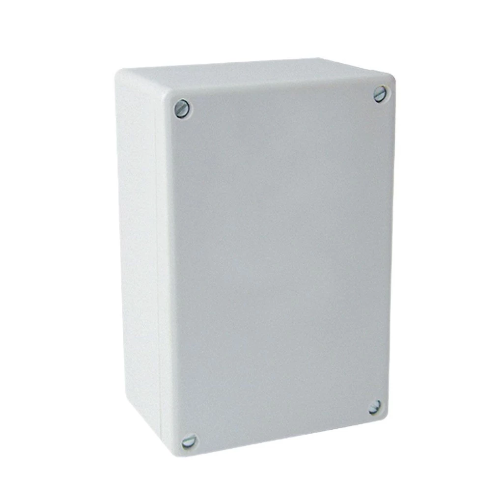
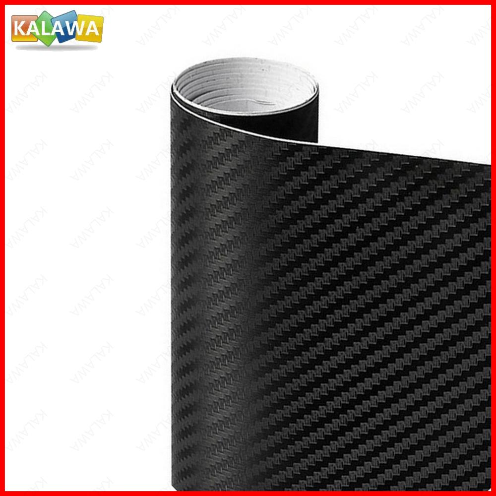
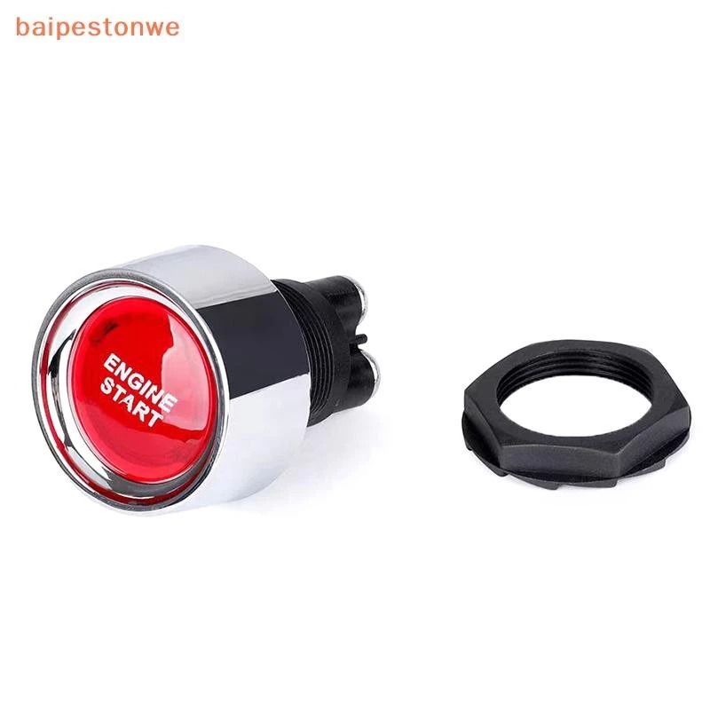
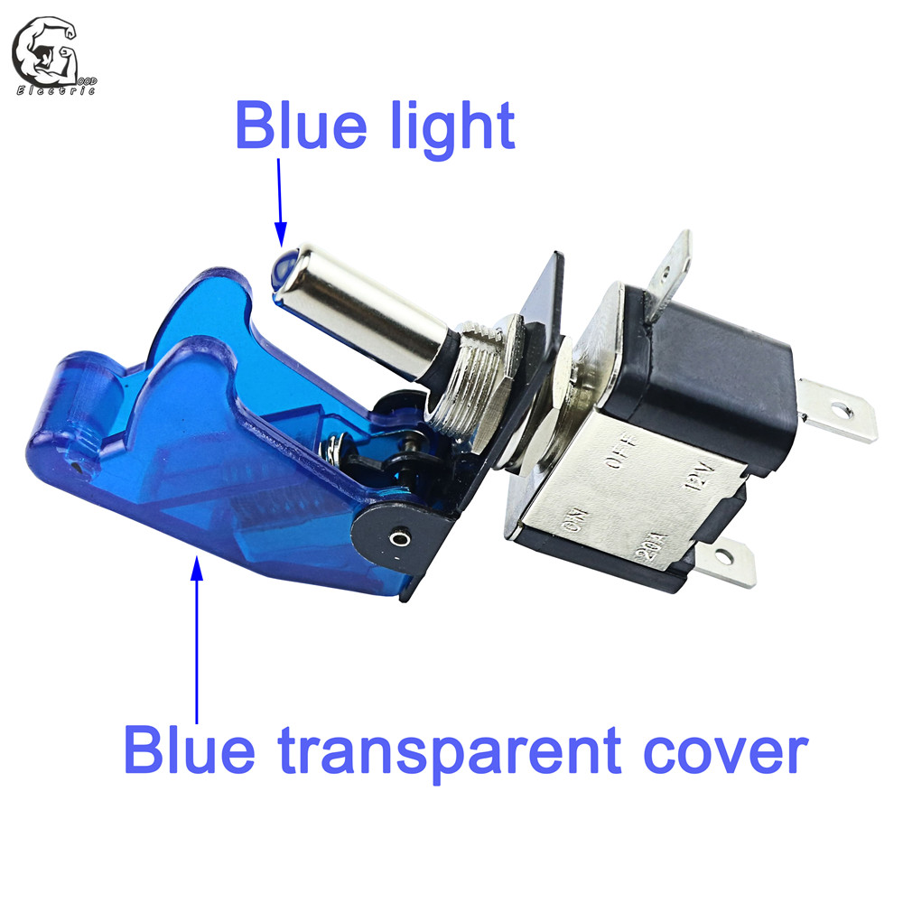
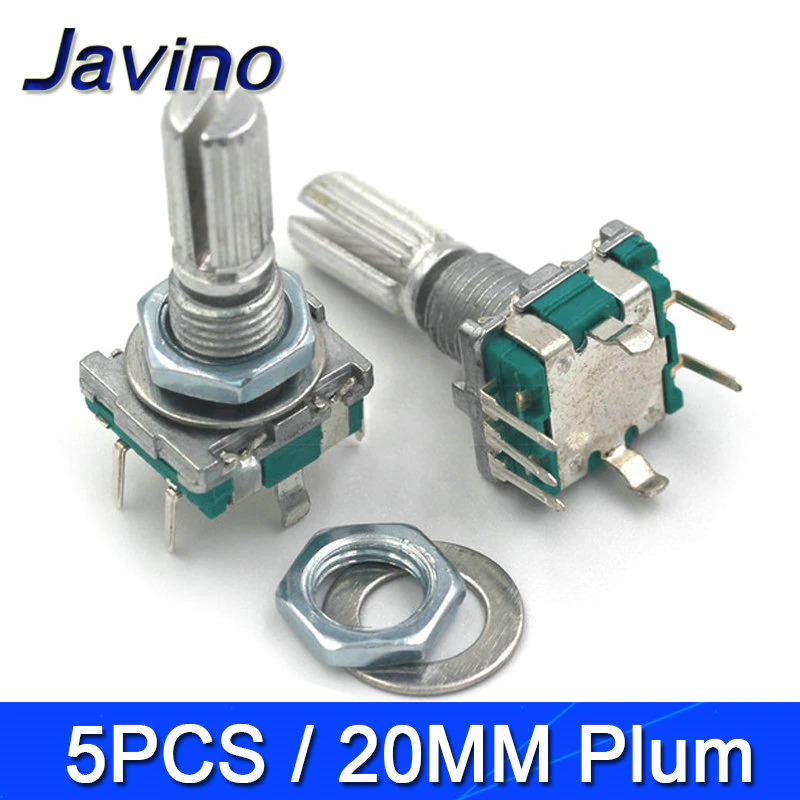
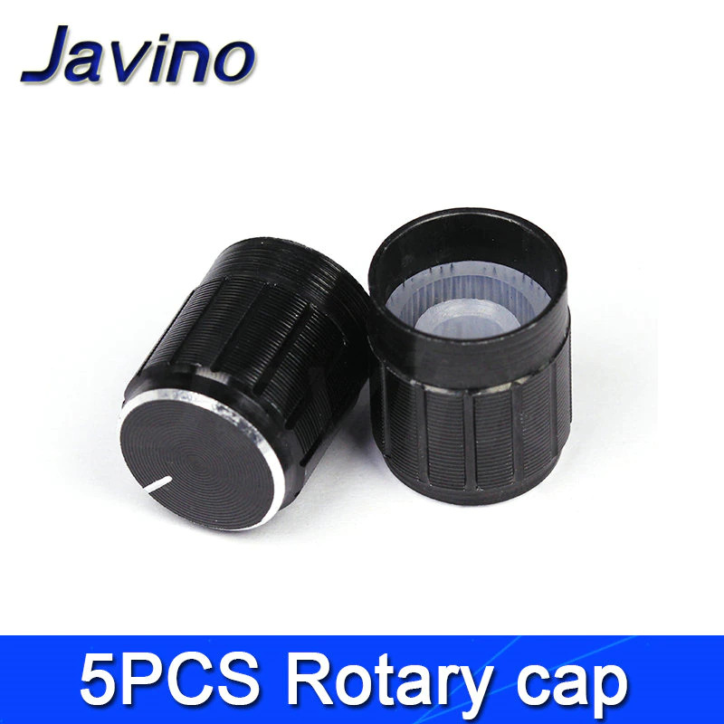
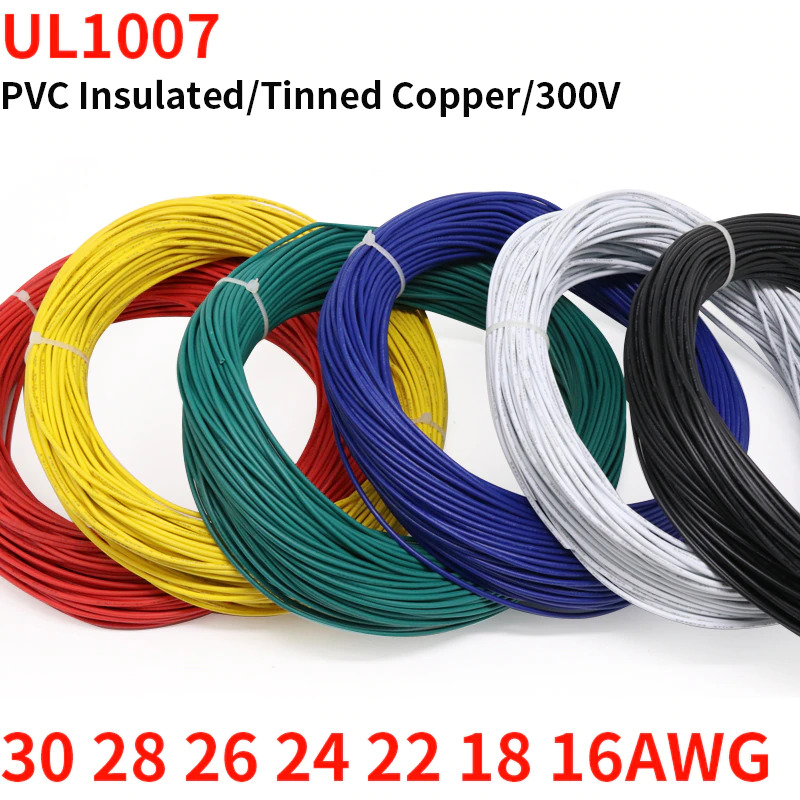

# DIY Sim Racing Button Box

I have some issues while marking up a switch holes and wire soldering so i decided to share my templates and "how to" guide.

Original credits goes to [AMSTUDIO](https://github.com/AM-STUDIO/32-FUNCTION-BUTTON-BOX) and [Opensimhardware](https://opensimhardware.wordpress.com/diy-arduino-buttonbox-version-1-eng/).

  
Table of Contents

  <ol>
    <li><a href="#layout-template">Layout Template</a></li>
    <li><a href="#wiring-diagram">Wiring Diagram</a></li>
    <li><a href="#components">Components</a></li>
    <li><a href="#software-setup">Software Setup</a></li>
  </ol>

## Layout Template

[Download vector template](/buttonbox_layout.ai)

Utilize it for drilling holes for buttons and switches. It has real sizes for all components listed below, just print it and put it over your plastic case 200 x 120 mm.
Use inside circles diameters. You should have drill bits sized 6, 7, 12, 14, 16 mm.

## Wiring Diagram

[Download drawio diagram](/buttonbox_wiring.drawio)

It's another side of the box cover that's why all buttons are mirrored.
You can open the source file in [diagrams.net](https://app.diagrams.net) editor.

## Components
Here's what I used for building button box.
Overall cost US $34.4 (2629 Rub).

 
[Arduino Pro Micro ATmega32U4 5V 16MHz (No soldering) ](https://shopee.com.br/Placa-Arduino-Nano-Com-Conector-V3-Pino-Sem-Solda-Atmega328p-i.457636598.22100357343?sp_atk=c3ac6348-003d-4aab-b0e7-5f57566a8025&xptdk=c3ac6348-003d-4aab-b0e7-5f57566a8025)
BRL 34,90

 
[PZOZ Micro USB Cable (2 m)](https://shopee.com.br/Cabo-Carregador-Controle-X-Box-Series-S-Ps5-3-Metros-Type-C-i.999193812.23395741855)
BRL 19,90

 
[Waterproof Black Electronic Case (200 x 120 x 75 mm)](https://shopee.com.br/CAIXA-PL%C3%81STICA-DE-PASSAGEM-MULTIUSO-195x115x70mm-STRAHL-3035-i.647079001.14733681306)
BRL 26,89

 
[3D Carbon Fiber Vinyl Black (30 x 127 cm)](https://shopee.com.br/2m-X-60cm-Vinil-Adesivo-Envelopamento-Fibra-Carbono-Preto-i.660595518.22793522564)

 
[Reset (Momentary) Round Engine Start Metal Push Button(22mm Red)](https://shopee.com.br/-baipestonwe-Bot%C3%A3o-De-Partida-Do-Motor-Carro-Interruptor-Sem-Chave-De-Igni%C3%A7%C3%A3o-Interruptores-Liga-Desliga-i.589728500.29222489778)
BRL 24,89 + Taxes

 
[Miniature Toggle Momentary (on-off-on) Switches (MTS-123 Reset) x 5 Pcs](https://shopee.com.br/10-Chave-Alavanca-2-Posi%C3%A7%C3%B5es-3-Terminais-Mts102-6A-i.544761445.23692799942?xptdk=4fc808ea-0e1f-4cc4-b7c1-55ee7053b0b7)
BRL 13,50

 
[Toggle Switch Illuminated Led Red (ASW-07D)](https://shopee.com.br/Bot%C3%A3o-Chave-Liga-Desliga-2-Posi%C3%A7%C3%B5es-Tipo-Ca%C3%A7a-com-Capa-Colorida-i.864769091.18099237365)
BRL 22,99

 
[Toggle Switch Black (ASW-07D)](https://shopee.com.br/Bot%C3%A3o-Chave-Liga-Desliga-2-Posi%C3%A7%C3%B5es-Tipo-Ca%C3%A7a-com-Capa-Colorida-i.864769091.18099237365)
BRL 22,99

 
[16 mm Momentary (Reset) Push Button Blue (PBS-33B) x 4 Pcs](https://shopee.com.br/12mm-16mm-Electronic-Led-Metal-Momentary-Push-Button-Waterproof-On-Off-Latching-Car-Light-Switch-12-V-220-V-i.444112290.9656675856)
BRL 8,80 + Taxes

 
[16 mm Momentary (Reset) Push Button Red (PBS-33B) x 4 Pcs](https://shopee.com.br/12mm-16mm-Electronic-Led-Metal-Momentary-Push-Button-Waterproof-On-Off-Latching-Car-Light-Switch-12-V-220-V-i.444112290.9656675856)
BRL 8,80 + taxes

 
[Rotary Encoder EC11 w Push Button 20mm Plum handle x 5 Pcs](https://shopee.com.br/5x-Potenci%C3%B4metro-Rotativo-5-pinos-Encoder-EC11-c-click-20mm-i.980376317.22793202606?sp_atk=7ea1b003-9473-4e16-ac67-fd75ec2faddc&xptdk=7ea1b003-9473-4e16-ac67-fd75ec2faddc)
BRL 32,50

 
[Rotary Caps Black x 5 Pcs](https://shopee.com.br/5x-Knob-para-Potenci%C3%B4metro-Eixo-Estriado-6mm-i.343657323.11386670942)
BRL 26,68

 
[PVC Tinned Copper Wire Cable Black (30 AWG) 2m](https://www.aliexpress.com/item/2M-UL1007-PVC-Tinned-Copper-Wire-Cable-16-18-20-22-24-26-28-30-AWG/1005001657149453.html?spm=a2g0s.12269583.0.0.2c31205b1yiOka)

[PVC Tinned Copper Wire Cable Red (30 AWG) 2m](https://www.aliexpress.com/item/2M-UL1007-PVC-Tinned-Copper-Wire-Cable-16-18-20-22-24-26-28-30-AWG/1005001657149453.html?spm=a2g0s.12269583.0.0.5098205bUb3MU6)

[PVC Tinned Copper Wire Cable White (30 AWG) 2m](https://www.aliexpress.com/item/2M-UL1007-PVC-Tinned-Copper-Wire-Cable-16-18-20-22-24-26-28-30-AWG/1005001657149453.html?spm=a2g0s.12269583.0.0.388a205bQUUxiJ)

## Software Setup
Ten simple steps any of you can done without special programming skills.

1. Download and install [Arduino IDE](https://www.arduino.cc/en/software).
2. Download [ArduinoJoystickLibrary](https://github.com/MHeironimus/ArduinoJoystickLibrary/archive/master.zip).
3. In the Arduino IDE, select `Sketch` > `Include Library` > `Add .ZIP Library...`.  Browse to where the downloaded ZIP file is located and click `Open`. The Joystick library's examples will now appear under `File` > `Examples` > `Joystick`.
4. Get [32-FUNCTION-BUTTON-BOX](https://github.com/AM-STUDIO/32-FUNCTION-BUTTON-BOX) sketch file.
5. Open Arduino IDE and add `Keypad.h` library by clicking `Sketch` > `Include Library` > `Manage Libraries...` > Search for `Keypad` and install the one that is created by `Mark Stanley and Alexander Brevig`).
6. Connect your Arduino board to your computer by plugging in the USB cable.
7. To upload the code select the Arduino type by going to `Tools` > `Board:...` > `Arduino Leonardo`.
8. To select the correct USB port go to `Tools` > `Port:` > `COMx (Arduino Leonardo)`.
9. Verify the sketch by clicking on the `✓` in the top left corner (under File).
10. Press the `→` next to it to upload it to the Arduino.
